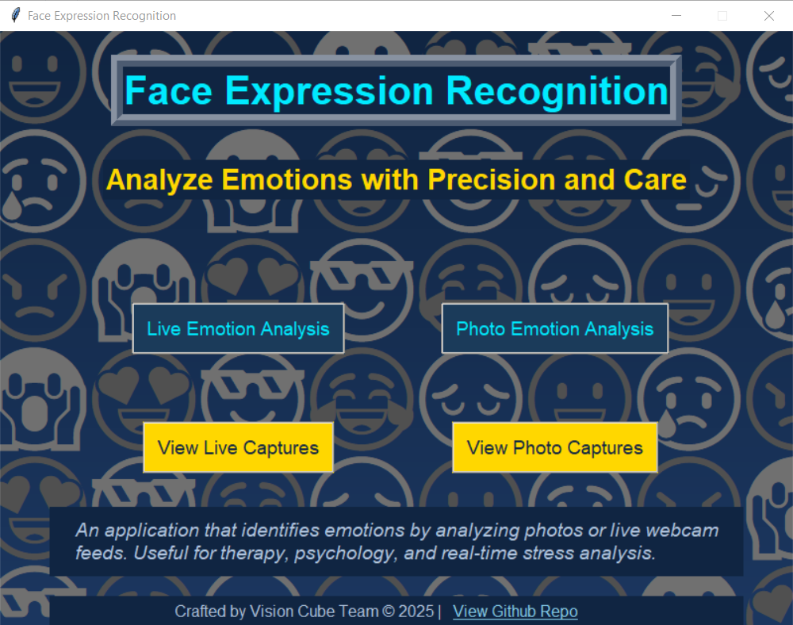
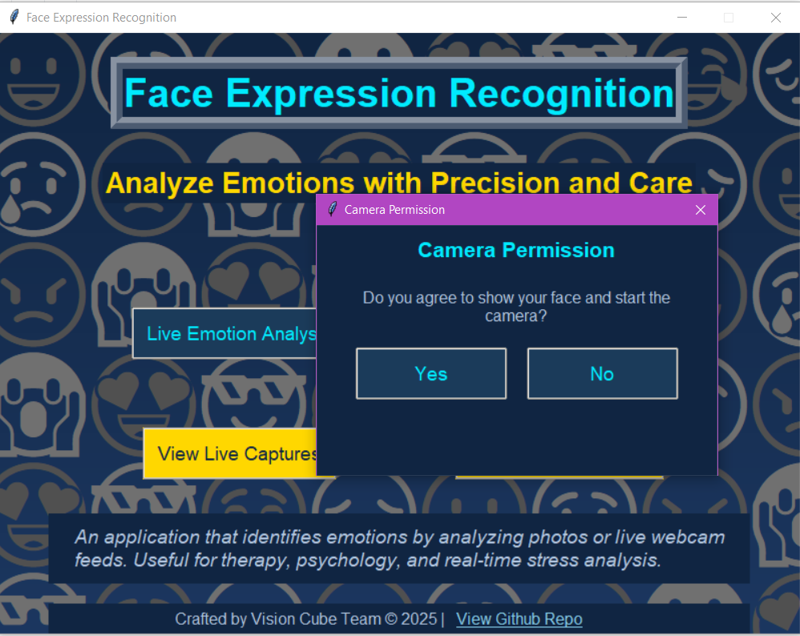
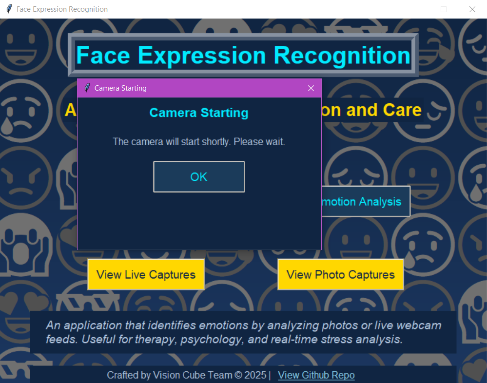
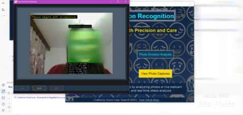
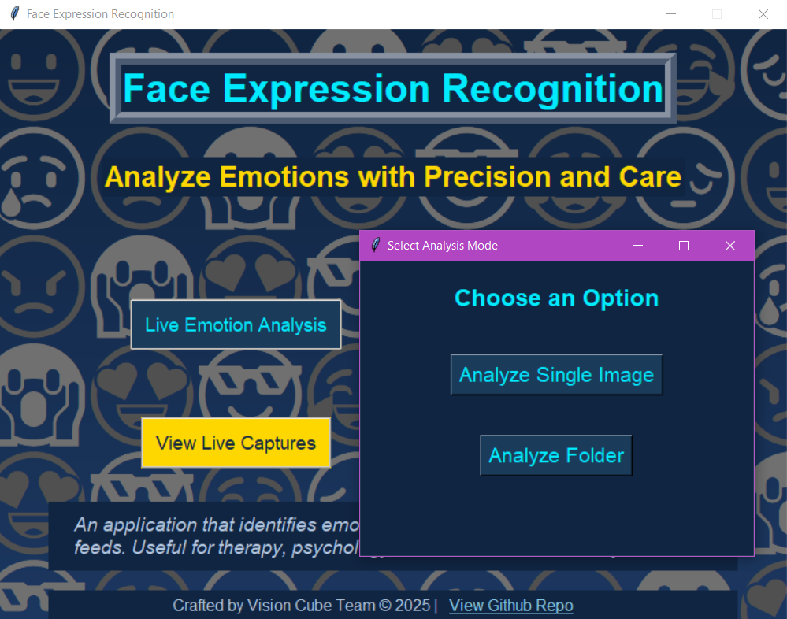
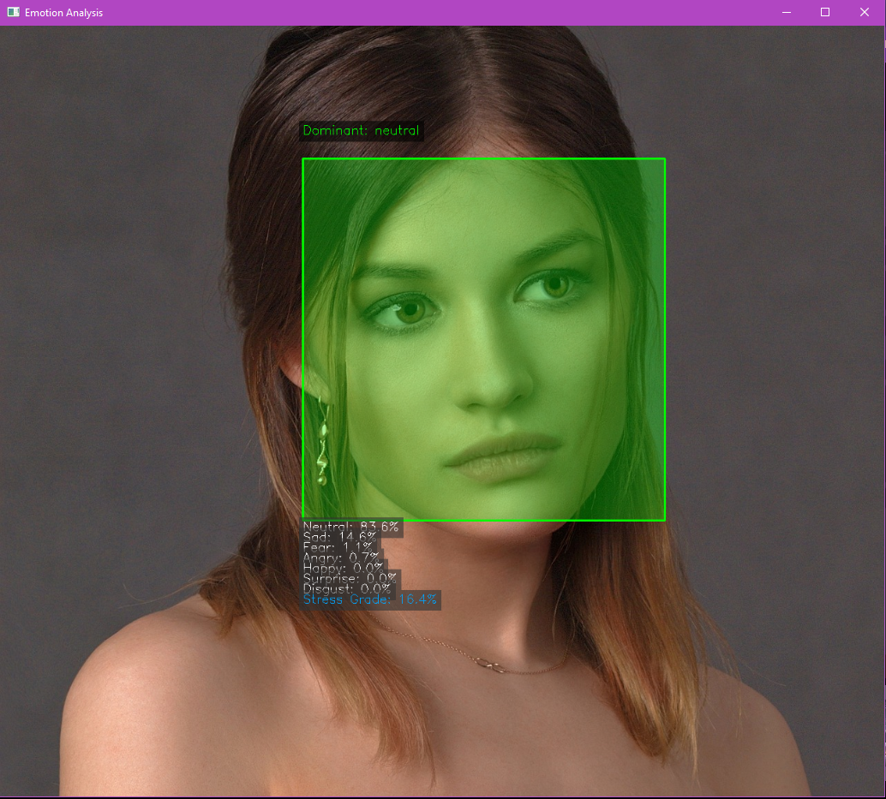
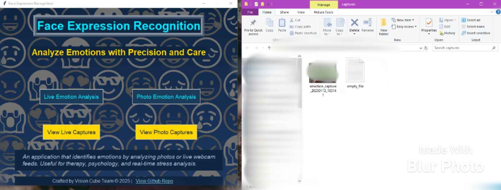
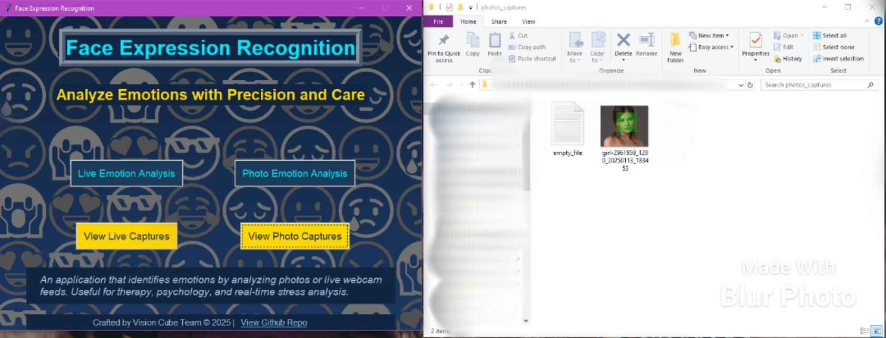

# 📸 **Emotion Detection from Multiple Sources**

Welcome to the **Emotion Detection Application** – a tool for identifying and analyzing emotions from images and live camera feeds. This project is built with an intuitive interface and powerful emotion recognition capabilities.

---

## 🚀 **About the Project**

This application uses **DeepFace** and **OpenCV** to detect and analyze human emotions in real-time or from static images. It’s equipped with a user-friendly graphical interface built with **Tkinter**, making it accessible for users of all levels.

### 🎯 **Core Features**
- 🖼️ **Image Emotion Analysis**: Upload an image and detect emotions with a visual overlay of results.  
- 📂 **Folder Analysis**: Analyze multiple images in a folder seamlessly.  
- 🎥 **Live Camera Emotion Detection**: Real-time emotion analysis from your webcam feed.  
- 💬 **Motivational Quotes**: Receive personalized quotes based on detected emotions.  
- 💾 **Save Results**: Captured images and results are automatically saved for later review.  

---

## 🛠️ **Technologies Used**

- **Python 3**  
- **OpenCV** – Image processing and camera interface  
- **DeepFace** – Emotion analysis  
- **Tkinter** – User interface  
- **Pillow (PIL)** – Image handling  

Check out all dependencies in [requirements.txt](requirements.txt).

---

## 💻 **How to Run the Project**

### 📥 **1. Clone the Repository**
```
git clone https://github.com/axbecher/emotion_detection_from_multiple_sources
cd emotion-detection
```

### 🐍 **2. Install dependencies**
```pip install -r requirements.txt```

### 🖥️ **3. Install dependencies**
```python ui.py```


## 🖼️ **How the Application Looks & Works**

This section provides a visual walkthrough of the **Emotion Detection Application**. Below are screenshots demonstrating key functionalities:

### **1. Home Screen**
The home screen offers intuitive navigation options to analyze emotions from live captures or photos.


### **2. Live Emotion Analysis**
When you select "Live Emotion Analysis," the application requests camera permissions to initiate real-time emotion detection.



Once the camera is active, the system analyzes your facial expressions, highlighting the detected emotions:


### **3. Photo Emotion Analysis**
You can also analyze static images by selecting "Photo Emotion Analysis" and choosing an image or folder:


The results display the dominant emotion and a breakdown of detected emotions, stress grades, and more:


### **4. Saved Captures**
The application automatically saves analyzed images and results for future reference.  
Captured images from live analysis are stored in the `captures` folder:


Analyzed photos from the "Photo Emotion Analysis" feature are saved in the `photos_captures` folder:


### 🤝 Contributors
<table>
  <tbody>
    <tr>
      <td align="center"><a href="https://axbecher.com"><br /><sub><b>Alexandru Becher</b></sub></a><br />
      </td>
      <td align="center"><a href="https://www.linkedin.com/in/codruta-lacatus/"><br /><sub><b>Codruta Alexandra Lăcătuș</b></sub></a><br />
      </td>
      <td align="center"><a href="https://hurr13ane.com"><br /><sub><b>Diana-Maria Iercosan</b></sub></a><br />
      </td>
    </tr>
  </tbody>
</table>


